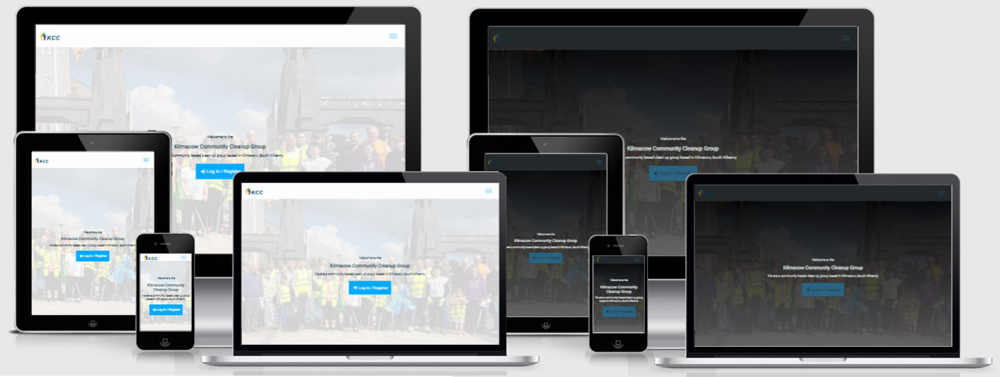
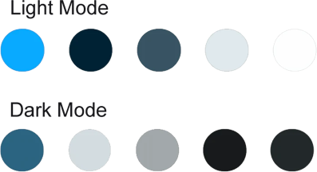
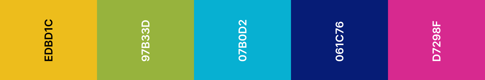

#  KCC App

[View the live project here.](https://kcc-app.herokuapp.com/)

To open links in a new tab:

MAC : &nbsp;  &nbsp; + &nbsp; 'click' 

Windows / Linux : &nbsp;   &nbsp; + &nbsp; 'click'

>This project was undertaken as my submission for the Python and Data Centric Development Milestone Project (MS3).

## Table of Contents

* [Overview](<#overview>)
* [UX](<#ux>)
  * [User Stories](<#user-stories>)
  * [Strategy](<#strategy>)
  * [Scope](<#scope>)
  * [Structure](<#structure>)
  * [Skeleton](<#skeleton>)
    * [Wireframes](<#wireframes>)
  * [Surface](<#surface>)
    * [Colours](<#colours>)
    * [Typography](<#typography>)
    * [Images](<#images>)
* [Features](<#features>)
* [Testing](<#testing>)
* [Technologies Used](<#technologies>)
* [Deployment](<#deployment>)
  * [Creation](<#creation>)
  * [Hosting](<#hosting>)
  * [Local](<#local>)
* [Credits](<#credits>)

## Overview

>The KCC App V2 was developed in conjunction with the Kilmacow Community Clean Up Group. The partnership initially began when we worked together on the KCC website, followed by the KCC App. Using feedback from both of these previous projects, we developed the new KCC App (Version 2) to incorporate the elements that users had provided positive feedback on. 
The goal of this app is to demonstrate the use of back-end technologies, to allow users to store data persistently in a cloud hosted database. Previously any reports a user posted were stored on the browser’s local storage and only available to the user who created them. 
Although, this app is designed as MVP, the hope is that it can be used a springboard to further develop the app into a fully functioning tool, that will provide users with a positive and useful resource.

[Back to Top](<#table-of-contents>)

## UX

### User Stories

Most of the users’ stories remain unchanged from the previous version of the App. The primary concern of the majority of users, was that “the reports they published, be available to all users”. The end goal of this feature will be to allow users mark a report as resolved / completed.

>#### First Time Visitors

* “I would like to learn more about the KCC”

* "I would like to register with the KCC so I can use all available features"

* "I would like more information on upcoming events"

>#### Returning Visitors

* "I would like to see if any events or reports have been added / updated since my last visit"

* "I would not like to see general information more suited to first time visitors"

* "I would like to contact the KCC group about future project ideas"

* "I would like to add my own reports and have them available to everyone, as well as the ability to see all others reports"

[Back to Top](<#table-of-contents>)

### Strategy

* Develop and deploy a minimal viable product to explore the viability of a full stack web application. 
* Develop a frontend with a simple / clean UI without the need for bloated CSS / JS frontend frameworks.
* Develop a backend using Flask, MongoDb, Python
* Develop a basic user authentication system
* Easy to navigate application / familiar interface
* Incorporate existing branding and colour scheme

[Back to Top](<#table-of-contents>)

### Scope

The previous (front end only) version of the app, featured a facility for providing feedback and suggestions for future development. The feedback was gathered and the most requested features / changes included:
* “The removal of unnecessary information, i.e. About info, Events info etc!” – an agreement was made that logged in (returning users) would not see this information. It would be only available to first time users / visitors without login credentials. This would allow the app to work as both a brochure website and a functioning app for registered KCC users.
* “The client has requested I develop and maintain the app” – a 6-month period would be used to trial the efficiency of the app. A cost benefit analysis at the end of the trial will determine the viability of the app and whether it should be developed into a fully functioning application (hosting costs, cdn costs, ssl costs etc!)
* “Layout issues” – a few members commented that the layout of the previous app was cumbersome and difficult to navigate. They commented that the fact the app didn’t launch in a native style (from the app drawer) that it shouldn’t look and feel like a native app. They mentioned they preferred the website style layout. This maybe a feature we need to revisit in the next stage of development.

[Back to Top](<#table-of-contents>)

### Structure

The application aims to look and feel like a brochure website. Based off the feedback from previous versions of the app / website, the client decided they would like to keep the original design and feel of the app, commenting that “the single page layout was confusing to some less experienced web users”, they also mentioned that “the original colours were more inviting and in line with the groups brand message”. Upon navigating to the app, the user is greeted with a hero image, welcoming them to the page. If this is a returning visitor their username will be included in the welcome message and the about section detailing the activities and history of the KCC will be hidden, as per the client’s request. Each section of the app is separated into it’s own page, with the exception of the login / register page which reuses the same code.

#### Home: 

The home section of the app contains a large hero image and welcome message. A CTA button below the welcome message redirects the user to Login or Register. If the visitor is a registered user, the welcome message is personalised with their username and the CTA button redirects the user to the reports page. Below the hero image is a section with a text block outlining what the KCC is about, again if the visitor is a registered user, this text will be hidden as returning users requested not to see it.

### Reports:

The reports section of the app is only accessible to logged in, registered users. The reports section of the app shows an image letting the user know there is no reports to show. Once the user clicks the call-to-action button they will be asked for their location. The pop-up form includes an input field for a brief description of the report, allows them to capture images from their device or upload images, displays the images in a slider and once submitted, the report is stored in a database and the uploaded images are sent to Cloudinary, the URLs of the images are stored in the database. Upon returning to the page after posting reports, the user will see cards showing their previous reports. – The scope of this section is to allow the user filter reports b y who posted them, ie. their own reports / reports posted by others. During the development of this section, the client asked me to remove this capability until the current user base (KCC members) were up to speed on the layout and function of the site. 

### Events

The events section of the app is available to all users of the app. The block of text describing the events carried out by the KCC is hidden if a user is logged in. The event cards expand when clicked to reveal further information about the event, a feature the client really liked throughout the development. It is envisaged that the user will be able to click a button on the next version of the app, that will allow them to add the event to their calendar and respond to the event page on Facebook.  

### Contact

The Contact section contains a form for contacting the KCC. The form will allow visitors include their name and email address; a text area will provide a method for visitors to include a personalised message. The contact section also includes the contact details for the KCC, such as an email address, postal address and contact number. Links to the group’s social media pages are below. These links remain inactive whilst the group setup their social media accounts. To date the only social media profile available is a Facebook page with limited likes and follows (approx. 100 & 110 respectivley).

### Login / Register

Both the login and register pages reuse the same code. The user is asked to provide a username & password to either register / login. Future versions of the app will prompt the user to update their profile page once they login (if it is incomplete). This appears to be common practice in modern web apps, as not to interrupt the registering process for new users. The register / login form uses standard validity to ensure the form is completed successfully, i.e. regex, min & max length, required, show / hide password, etc!

[Back to Top](<#table-of-contents>)

### Skeleton

#### Wireframes
[Balsamiq Wireframes](https://balsamiq.com/wireframes/) was used to wireframe the website.

>* [Home Page](static/docs/Home.pdf)
>* [Report Page](static/docs/Reports.pdf)
>* [Events Page](static/docs/Events.pdf)
>* [Contact Page](static/docs/Contact.pdf)
>* [Login / Register Page](static/docs/Login.pdf)

[Back to Top](<#table-of-contents>)

### Surface

The KCC app uses the same logo that is featured on the clients existing website and additional branding. A fresh "App Shell" colour scheme was chosen. I believe this will elevate the appearance of the app.

#### Colours

The web app features 2 colour schemes (dark mode & light mode) based on the users OS / browser settings. The stylesheet contains the media query prefers-color-scheme: to determine the colour scheme displayed. In order to keep the colour scheme dynamic and configurable, the colours used are hsl. This allows me to use CSS calc() functions for lightening and darkening the colour scheme as needed. I followed a very popular tutorial by Adam Argyle, it is available to view here: [Building a color scheme](https://web.dev/building-a-color-scheme/)

Highlight colours are the same as the KCC website. The client chose this pallette at the very early stage of our journey.

#### Typography

>The font used throughout the website is Roboto, with Sans-Serif used as a fallback. The font weight and font size css attributes are used with the font for emphasis and hierarchy. The font was Designed by Christian Robertson and is made openly available by Google Fonts [here](https://fonts.google.com/specimen/Roboto)

#### Images

>The licence for the logo is available [here](static/docs/logolicence.pdf). Vectors were selected from my Adobe Stock account to display on the events page if no data is available and on the reports page if no previous reports were made. The licences for both are available [here](static/docs/vectorlicence.pdf).

#### Icons

[Icomoon](https://icomoon.io/) was used to create a custom icon set. Not only does this allow you to pick and choose icons from multiple icon packs, it dramatically reduces the overhead of using fontawesome.

[Back to Top](<#table-of-contents>)

## Features

### Overview
* Responsive front end Web Application built with HTML, CSS, JavaScript
* Back end built with Python / Flask, MongoDB
* Fixed navigation bar for easy navigation as per client’s request
* Expandable and collapsible event cards
* Contact form
* Report form with image capture / upload and geolocation information 

#### Navbar

>* The navbar menu should display options based on whether the user is Logged In or not
>* The menu should expand and collapse when the nav button is clicked
>* The menu links should display the relevant page when clicked

#### Home Page

>* The home Page should display upon visiting the app. It should also be accessible by clicking the KCC logos throughout the app 
>* The header should contain a personalised greeting if the user logged in previously. The CTA button should change based on whether the user is logged in or not.
>* The home Page text should be only visible to users not registered with the KCC

#### Login / Register Page

>* The Login / Register Pages should display a form with two required fields, username and password. A “show password” button is included to assist the user. This should reveal the entered password when clicked.
>* The username and password fields require validation, the user will be prompted if an invalid username or password is entered.
>* On devices with slower connections, the submit button will provide visual feedback to the user that a task is still running (e.g. fetching the user from the database)
>* If an unsuccessful attempt is made to login or register, the user will be provided with an error message to provide them feedback on the issue / error.

#### Reports Page

>* The first time a user visits the reports Page should show the user there is no previous reports
>* The report pop-up form should display once the cta button is clicked
>* The user should be requested location permissions by the browser
>* The New Report form should display the user’s current position
>* Upon clicking the image upload button, the user should be asked to upload images or capture from their device’s camera
>* Upon selecting / capturing images – these images should be displayed back to the user
>* On submission of the report form, the pop up should close.
>* On the second visit to the page, the user’s previous reports should be displayed
>* The report cards should contain the location and time of the report

#### Events Page

>* The Events Page is accessed by clicking the relevant link on the navbar 
>* This Page contains event cards. The event cards should wrap underneath each other on mobile devices.
>* If no events are available to show, a notification image should appear
>* The event cards should expand and collapse when clicked

#### Contact Page

>* The Contact Page is accessed by clicking the relevant link on the navbar 
>* The Contact Pages has two subPages.
>* The first Page should display contact information for the KCC including postal address, email address, phone number and social media links. These links should navigate to the correct pages and where applicable, open links in new tabs / applications
>* The second Page contains a contact form where visitors can contact the KCC.
>* The form contains name and email inputs that are required, a text area for general comments or messages.
>* The submit button should indicate ‘a state of loading’ once clicked, provided all form validations pass

### Features to implement
* Admin dashboard with user control functions and Event CRUD feature.
* Service worker to be added to the application, this will allow the app to be installed on the user’s device. (beforeInstallEvent) - capture & update the user interface with a customised button for installing the PWA
* The Service worker will also expose the cacheApi - precache the app shell for fast page speeds and 'offline' functionality
* backgroundSyncApi - allow the users to post reports even when offline - the background sync api can store the data locally, posting to the api endpoint when the device regains network connection. It is proposed that workbox be used for this. 
* Cookie notification pop up and privacy policy (feature commented out)

[Back to Top](<#table-of-contents>)

## Testing

> Due to the large file size, the testing section is available in it's own file 
>* [Testing](testing.md)

[Back to Top](<#table-of-contents>)

## Technologies

### Languages & Frameworks

* HTML5
* CSS3
* JavaScript
* Python
* Flask
* MongoDB 

### Fonts & Icons

* [Roboto](https://fonts.google.com/specimen/Roboto) - Self hosted
* [IcoMoon](https://icomoon.io) - Self hosted icons

### Development, Version Control, Storage, Debbugging

* [Gitpod IDE](https://www.gitpod.io) - IDE 
* [Git](https://git-scm.com/) - version control system
* [Github](https://github.com/) - repository storage
* [Chrome DevTools](https://developers.google.com/web/tools/chrome-devtools) - used for debugging code
* [MongoDB](https://www.mongodb.com/) - used as database deployment
* [Heroku](https://www.heroku.com/) - cloud based platform used for running and operating application
* [Cloudinary](https://www.cloudinary.com/) - Image hosting CDN with api for dynamically storing and retrieving report images

### Software & Applications

* [Adobe Photoshop](https://www.adobe.com/ie/products/photoshop.html) - image resizing & editing
* [Adobe Illustrator](https://www.adobe.com/ie/products/illustrator.html) - used for vector & svg editing
* [Balsamiq Wireframes](https://balsamiq.com/wireframes/) - used for wireframing website
* [Typora](https://typora.io/) - help with markdown writing & editing 
* [Microsoft Word](https://www.microsoft.com/en-ie/microsoft-365/word) - content wrtiting
* [Uizard](https://uizard.io/) - AI based wireframing solution
* [README so](https://readme.so/editor) - help with markdown tables

### Resources

* [Tiny PNG / JPG](https://tinyjpg.com/) - compressing images
* [Am I Responsive](http://ami.responsivedesign.is/#) - viewport image for README
* [RKG - Random Key Generator](https://randomkeygen.com/) - random key generator

### Testing

* [Validator](https://validator.w3.org/) - HTML code validator
* [Jigsaw](https://jigsaw.w3.org/css-validator/) - CSS code validator
* [GTmetrix](https://gtmetrix.com/) - Site performance testing
* [WAVE](https://wave.webaim.org/) - Site accessibility testing
* [Online Spell Check](https://www.online-spellcheck.com/) - README spell checker
* [LambdaTest](https://www.lambdatest.com/) - cross browser testing

[Back to Top](<#table-of-contents>)

## Deployment

### Creation

The project was created using the Code Institute workspace template, available [here](https://github.com/Code-Institute-Org/gitpod-full-template).
To use this template:

1. Click use this template
2. Name the new repository and select ‘Create repository from template’
3. Navigate to the newly created repository and select Gitpod*
4. The template workspace should now open in Gitpod

>*The Gitpod browser extension must be installed for this option to become visible. Gitpod provide a browser extension for Chrome [here](https://chrome.google.com/webstore/detail/gitpod-dev-environments-i/dodmmooeoklaejobgleioelladacbeki) and for Firefox [here](https://addons.mozilla.org/en-US/firefox/addon/gitpod/)

### Hosting

This website is hosted on [Heroku](https://heroku.com/). To deploy the live site, I followed these steps:

1. Create an account on Heroku & login
2. Click New dropdown and select "Create New App".
3. Give the app a name and select Europe as the region.
4. Go to deploy and setup connection to Github (enable automatic deploys).
5. Navigate to the settings section and click reveal config vars.
The following config vars are required for the application to connect to MongoDb & Cloudinary:

Click the settings tab and then click the Reveal Config Vars button and add the following:

| KEY             | VALUE                                                                |
| ----------------- | ------------------------------------------------------------------ |
| API_KEY | - cloudinary api key - |
| API_SECRET | - cloudinary secret - |
| CLOUD_NAME | - cloudinary cloud name - |
| IP | 0.0.0.0 |
| MONGO_URI | - uri of mongo instance - |
| MONGO_DBNAME | - db of mongo database -|
| PORT | 5000 |
| SECRET_KEY | - generated from FKG - |

### Local

To run this project locally there are two options through Github (clone or download). To clone or download, navigate to the repository, click the Code button and select Clone or Download:

1. Clone: This option provides you with a URL that can be used in your local IDE. Use the 'git clone' command followed by the provided URL to create a clone of the project locally.

2. Download: This option provides a .zip file that can be downloaded, extracted and deployed to a local webserver or edited in your IDE.

[Back to Top](<#table-of-contents>)

## Credits

### Content

All text content was written by myself with approval from The Kilmacow Community Clean-up Group.

### Image

The licence for the logo is available [here](static/docs/logolicence.pdf). The licence for the additional images are available [here](static/docs/vectorlicence.pdf).

### Code Snippets

> CSS

* [The App Guruz](https://www.theappguruz.com/tag-tools/web/CSSAnimations/) - slideInDown & slideInLeft animations

> a11y
* [Scott Vinkle 13/04/2018 Medium](https://medium.com/@svinkle/why-let-someone-know-when-a-link-opens-a-new-window-8699d20ed3b1) - a11y tips for screen readers

### Acknowledgements

> Stack Overflow and the Code Institute LMS proved to be invaluble resources
> My employer for allowing me time to juggle a hectic work schedule and completing this project

[Back to Top](<#table-of-contents>)